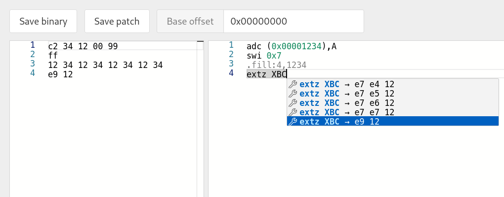
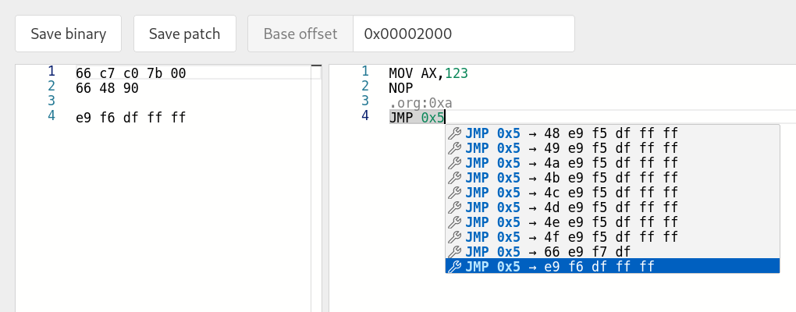
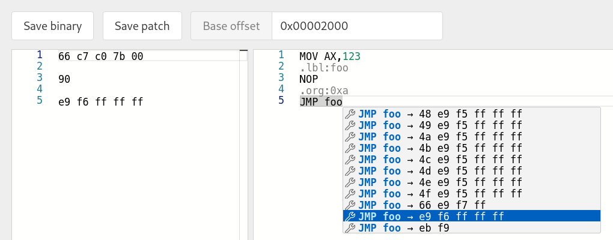

# Ghembler

Assembler and Disassembler for Ghidra processor modules featuring auto-completion. Besides the intended pun in the name, it also suggests taking the risk of finding bugs. 🙂

Example using [Toshiba TLCS-900/H](https://github.com/nevesnunes/ghidra-tlcs900h):



Example using x86-64 (jump to relative vs absolute address):





`Save patch` generates a Python script that applies instructions at the given base offset to an input file:

```python
#!/usr/bin/env python3

import sys

with open(sys.argv[1], 'r+b') as f:
    b = b''
    # MOV AX,123
    b += b'\x66\xc7\xc0\x7b\x00'
    # NOP
    b += b'\x66\x48\x90'

    f.write(b)

    f.seek(0x8)

    b = b''
    # JMP 0x5
    b += b'\x48\xe9\xf7\xdf\xff\xff'  # relative to base offset 0x2000

    f.write(b)
```

## Why not just use Ghidra?

We can modify a disassembled instruction or edit cleared bytes with action "Patch Instruction", which is fine once you change the default keybind to use a single key.

However, once there's the need for more common text editor operations (insert/delete/copy/paste), it becomes clunky, and any [workarounds are very limited](https://gist.github.com/murachue/5d39a614d1803d7d327bee95d81f495b).

I'd also like to introduce some assembler-specific features (directives/macros/labels).

## Running

Backend (Ghidra script):

```sh
# Create zero-filled file so that the script has a program available
dd if=/dev/zero of=/tmp/0.bin bs=1024 iflag=count_bytes count=$((0x10000))

# Run script headless, wait until ready:
# INFO  AsmServer.java> Listening at port 18000... (GhidraScript)
GHIDRA_INSTALL_DIR=FIXME
GHIDRA_PROJECT_DIR=FIXME
GHIDRA_PROJECT_NAME=FIXME
"$GHIDRA_INSTALL_DIR/support/analyzeHeadless" "$GHIDRA_PROJECT_DIR/" "$GHIDRA_PROJECT_NAME/_headless" \
        -import /tmp/0.bin \
        -overwrite \
        -processor 'TLCS900H:LE:32:default' \
        -noanalysis \
        -scriptPath ./ghidra_scripts \
        -postScript AsmServer.java
```

Frontend:

```sh
npm install
npm run server
```

[Optional] Sanity check:

```sh
# Expecting two encodings returned when assembling the given instruction
curl -X POST -H "Content-Type: text/plain" --data "jp NZ/NE,XWA+1" http://localhost:18000/assemble | jq .
# [
#   {
#     "type": "bytes",
#     "data": "b8 01 de"
#   },
#   {
#     "type": "bytes",
#     "data": "f3 e1 01 00 de"
#   }
# ]
```

## Testing

Run backend with `-processor 'x86:LE:64:default'`, then:

```sh
# Headless Mode
npx playwright test --project=chromium

# UI Mode
npx playwright test --debug --ui --project=chromium
```

## Related work

- [GitHub \- ret2jazzy/disasm\.pro: A realtime assembler/disassembler \(formerly known as disasm\.ninja\)](https://github.com/ret2jazzy/disasm.pro)
- [GitHub \- emproof\-com/nyxstone: Nyxstone: assembly / disassembly library based on LLVM, implemented in C\+\+ with Rust and Python bindings, maintained by emproof\.com](https://github.com/emproof-com/nyxstone)
- [GitHub \- gaasedelen/patching: An Interactive Binary Patching Plugin for IDA Pro](https://github.com/gaasedelen/patching)
